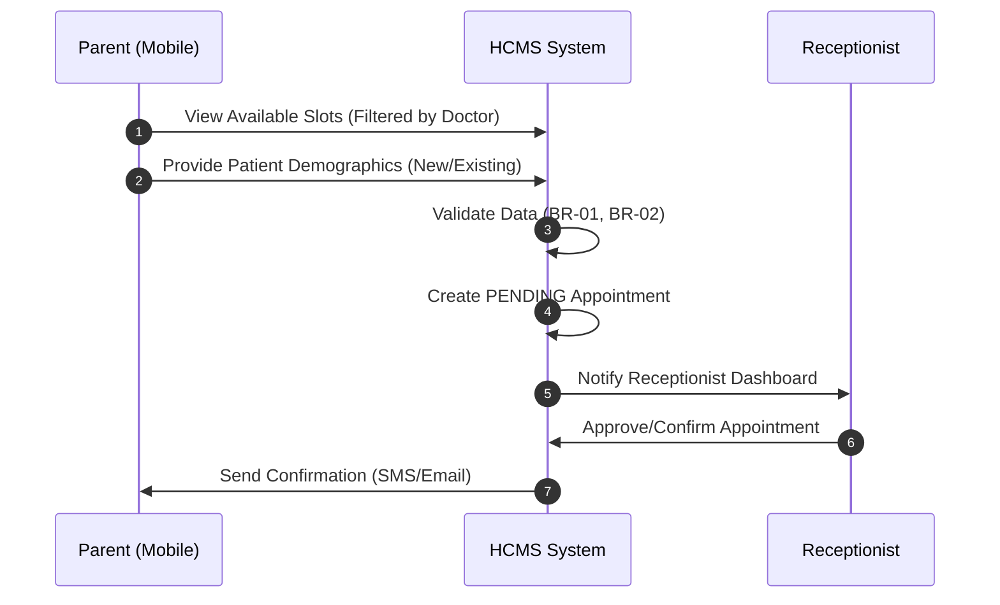

# Layer 1: System & Business Context (HCMS)

This layer defines the high-level vision, personas, and business goals of the Healthcare Clinic Management System.

## 1. Project Personas & Stakeholders

### Project Personas (The Core Team)
- **Senior BA / PM:** 
  - **Philosophy:** Omotenashi (total dedication to user experience) & Monozukuri (precision in engineering).
  - **Approach:** MECE (Mutually Exclusive, Collectively Exhaustive) thinking. 
  - **Guardrail:** Protective "gatekeeper" of the **Project Oath** to prevent scope creep.

### Stakeholder Personas (The Users)
- **BS. Minh (Lead Doctor / Sponsor):** 
  - **Pain Points:** Paper fatigue, manual prescription writing.
  - **Needs:** 100% digital EMR, medical autocomplete, real-time history lookup.
- **Chị Lan (Receptionist / Power User):** 
  - **Pain Points:** Phone call overload, billing errors, manual scheduling.
  - **Needs:** Self-service portal for parents, 1-click checkout, visual paid/unpaid status.
- **Chị Vy (Parents / Final Users):** 
  - **Pain Points:** Long wait times, lost medical booklets, friction in booking.
  - **Needs:** Mobile-first self-service, transparent record access, easy rescheduling.

## 2. Vision and Scope

### Business Context
- **Domain:** Pediatric Private Clinic.
- **Operational Model:** High focus on efficiency and digital-first interaction.
- **Scale:** 1-2 Doctors, 1 Receptionist, 10-20 patients/day.
- **Timeline:** 4-6 weeks MVP (Go-live: 15/06/2026).

### Business Goals
1. **Administrative Efficiency:** Target 0% manual phone booking for repeat visits through the Self-Service Portal.
2. **Clinical Accuracy:** 100% digital trace for every symptom, diagnosis, and prescription.
3. **Financial Transparency:** Real-time billing status visibility with absolute zero manual invoice calculation.

### Project Oath (The Immutable Guardrails)
To meet the 1-month deadline, the following constraints are strictly enforced:
- **Strict Entity Lock:** The system architecture is built around EXACTLY 5 entities: `PATIENT`, `APPOINTMENT`, `VISIT`, `PRESCRIPTION`, `BILLING`. 
- **No Bloatware:** Any request involving Insurance Integration, Advanced Pharmacy Inventory, or Multi-branch scaling is **automatically rejected** for MVP.

## 3. Detailed Workflows

### WF-01: Self-Service Booking Online
- **Objective:** Empower parents to book slots without calling.
- **Sequence:**

### WF-02: Clinical Consultation (EMR Workflow)
- **Objective:** Eliminate paper medical records.
- **Steps:**
  1. **History Lookup:** Doctor opens `PATIENT` record, views all previous `VISIT` and `PRESCRIPTION` history.
  2. **Vitals/Symptoms:** Entry of clinical symptoms into the `VISIT` entity.
  3. **Diagnosis:** Doctor types diagnosis using **Autocomplete Suggester**.
  4. **Prescription:** Electronic entry of medicine line items (`PRESCRIPTION`).

### WF-03: 1-Click Checkout
- **Objective:** Fast, error-free financial processing.
- **Logic:**
  - Upon Doctor completing WF-02, the system **auto-generates** a `BILLING` record.
  - Total = (Visit Fee) + SUM(Prescription Items).
  - Receptionist performs "1-Click" to mark status as **PAID**.

## 4. BA & Design Rules
- **Problem Solving:** Always identify the "Pain Point" before proposing a feature.
- **Zero Ambiguity:** Use Tiếng Việt for business descriptions and English for system keywords.
- **MECE Analysis:** When documenting a logic flow, ensure there are no "Logical Dead Ends."
- **UX Requirement:** Minimize clicks. If a task takes >3 clicks, the design must be simplified.
