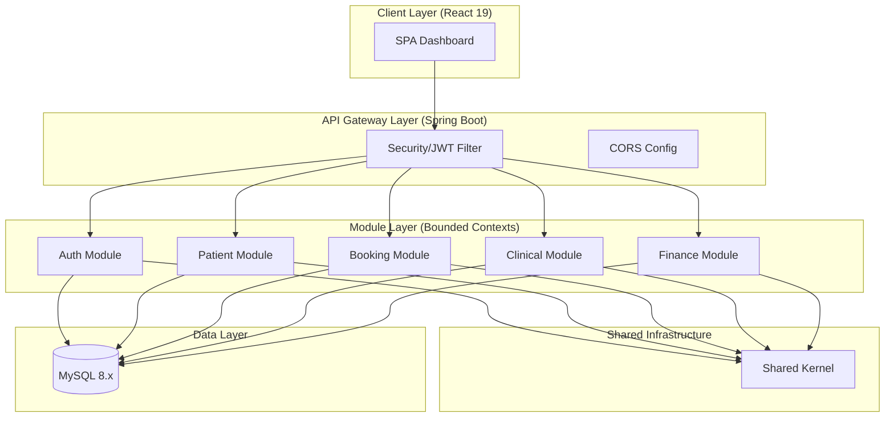

# Layer 2: Architecture Context (HCMS)

This layer defines the high-level architecture pattern, module boundaries, and interaction rules for the Healthcare Clinic Management System.

## 1. Architecture Pattern: Modular Monolith

As established in **ADR-001**, HCMS follows a **Modular Monolith** architecture. This pattern achieves a balance between the simplicity of a monolith and the separation of concerns found in microservices.

### Strategic Benefits:
- **Logical Isolation:** Each domain is physically separated by Java packages or modules.
- **Maintainable Deployment:** A single JAR/Deployment artifact simplifies CI/CD.
- **Microservices Ready:** The clear boundaries allow any module to be extracted into a standalone service if the system scales beyond MVP limits.

## 2. Bounded Contexts (Modules)

To prevent the "Big Ball of Mud" anti-pattern, the system is divided into clear business modules:

| Module | Responsibility | Core Entity |
|--------|----------------|-------------|
| **Auth** | Security, JWT, RBAC, User lifecycle. | `USER` |
| **Patient** | Demographic data, Medical history management. | `PATIENT` |
| **Booking** | Scheduling, Slot management, Calendar logic. | `APPOINTMENT` |
| **Clinical** | Clinical sessions, Diagnosis, EMR entries. | `VISIT` |
| **Pharmacy**| Electronic prescriptions, Medicine line items. | `PRESCRIPTION`|
| **Finance** | Billing calculations, Invoice status tracking. | `BILLING` |

## 3. Shared Kernel (The Backbone)

The **Shared Kernel** contains code and data structures used by **all** modules. It is strictly limited to:
- **Base Components:** Abstract Entity, Audit fields, Base DTOs.
- **Generic Utilities:** Date formatters, String helpers, Hashing tools.
- **Global Exceptions:** `BusinessException`, `ResourceNotFoundException`, `ValidationException`.
- **Domain Enums:** Enums shared across boundaries (e.g., `Gender`, `VisitStatus`).

## 4. Interaction Rules (Standard Operating Procedure)

To maintain modularity, developers MUST follow these cross-module rules:

### Rule 1: No Cross-Module Repository Access
- **BAD:** `BookingService` calling `PatientRepository.findById()`.
- **GOOD:** `BookingService` calling `PatientModuleInterface` or `PatientService.getPatientById()`.
- **Reason:** Ensuring that data access logic stays encapsulated within its own module.

### Rule 2: Module Communication via Service Layer
- Modules interact via **Services** or **Specific Interfaces**. 
- Ideally, cross-module communication should happen via DTOs, never raw Entities.

### Rule 3: Database Integrity vs. Logical Separation
- **Foreign Keys:** Are used to ensure data integrity at the DB level (ADR-002).
- **Service Dependency:** If `Module A` depends on data from `Module B`, it must request that data through the authorized Service API of `Module B`.

## 5. System Layer Diagram

## 6. Development Workflow
- **Module Creation:** When adding a feature, identify which Bounded Context it belongs to.
- **Boundary Check:** Always ask: "Does this service need to reach into another module's private folder?" If yes, create a public method in that module's service layer.
