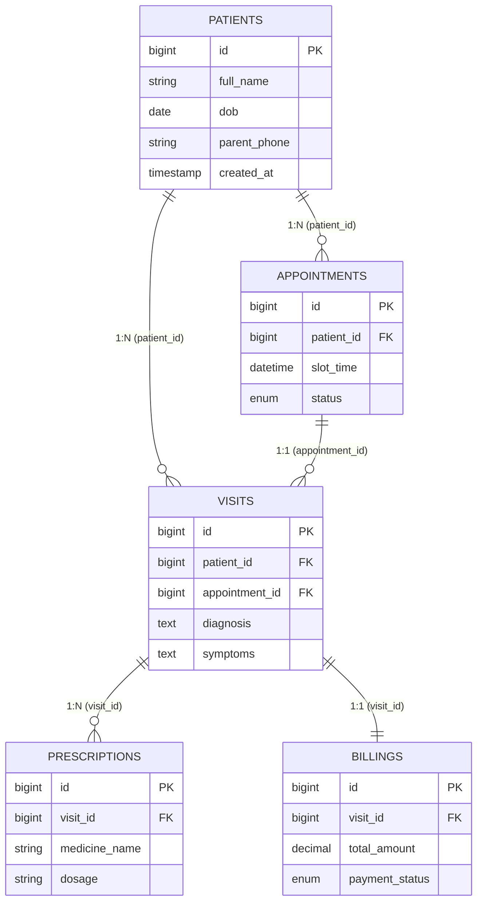

# Layer 4: Database Design Rules (HCMS)

This document defines the strict schema design, integrity rules, and DDL standards for the MySQL 8.x database.

## 1. System Requirements & Settings
- **Engine:** InnoDB (Required for Transactions and Foreign Keys).
- **Encoding:** `utf8mb4` (Full Unicode support for Vietnamese).
- **Idempotency:** All DDL scripts must use `CREATE TABLE IF NOT EXISTS`.
- **Migration:** Managed exclusively via **Flyway**.

## 2. Global Entity Relationship Diagram (ERD)

HCMS is strictly governed by the **5-Entity Rule**. No additional persistent entities are allowed for the MVP.



## 3. Data Integrity & Constraints

### Primary Keys
- Use `BIGINT UNSIGNED AUTO_INCREMENT` for all Primary Keys.
- Column name must be simply `id` (standardized across all tables).

### Foreign Keys
- Explicitly name every FK constraint: `fk_{child_table}_{parent_table}`.
- Columns MUST be named `{parent_table_singular}_id`.
- Referential Actions: `ON DELETE RESTRICT ON UPDATE CASCADE`. 
- **Exception:** Financial and Clinical records (`VISITS`, `BILLINGS`) must NEVER be cascade deleted.

### Audit Columns (Mandatory for ALL tables)
```sql
`created_at` TIMESTAMP NOT NULL DEFAULT CURRENT_TIMESTAMP,
`updated_at` TIMESTAMP NOT NULL DEFAULT CURRENT_TIMESTAMP ON UPDATE CURRENT_TIMESTAMP,
`deleted_at` TIMESTAMP NULL DEFAULT NULL
```

## 4. DDL Best Practice Sample

```sql
CREATE TABLE IF NOT EXISTS `patients` (
    `id`           BIGINT UNSIGNED NOT NULL AUTO_INCREMENT,
    `full_name`    VARCHAR(255) NOT NULL,
    `dob`          DATE NOT NULL,
    `phone`        VARCHAR(20) NOT NULL UNIQUE,
    `created_at`   TIMESTAMP NOT NULL DEFAULT CURRENT_TIMESTAMP,
    `updated_at`   TIMESTAMP NOT NULL DEFAULT CURRENT_TIMESTAMP ON UPDATE CURRENT_TIMESTAMP,
    `deleted_at`   TIMESTAMP NULL DEFAULT NULL,
    PRIMARY KEY (`id`)
) ENGINE=InnoDB DEFAULT CHARSET=utf8mb4 COLLATE=utf8mb4_unicode_ci;

-- Separate Index & Constraint Definitions
CREATE INDEX `idx_patients_phone` ON `patients` (`phone`);
```

## 5. Performance & Indexing
- **FK Indexing:** InnoDB does not automatically index FK columns. You MUST define an index for every `{referenced}_id` column to optimize JOIN performance.
- **Selective Indexing:** Only index columns appearing in `WHERE`, `ORDER BY`, or `JOIN` clauses. Avoid over-indexing columns with low cardinality (e.g., `gender`).
- **Data Types:**
  - Use `DECIMAL(10, 2)` for money.
  - Use `ENUM` for fixed states (e.g., `PENDING`, `PAID`).
  - Use `VARCHAR` over `TEXT` for searchable short strings.

## 6. Migration Rules
- **No Manual Deployment:** All schema changes must be submitted via `.sql` files in `src/main/resources/db/migration/`.
- **Naming Rule:** `V<Version>__<Description>.sql` (e.g., `V1__init_schema.sql`).
- **Idempotency:** Ensure scripts can be run multiple times (using `IF NOT EXISTS` and `IF EXISTS`).
