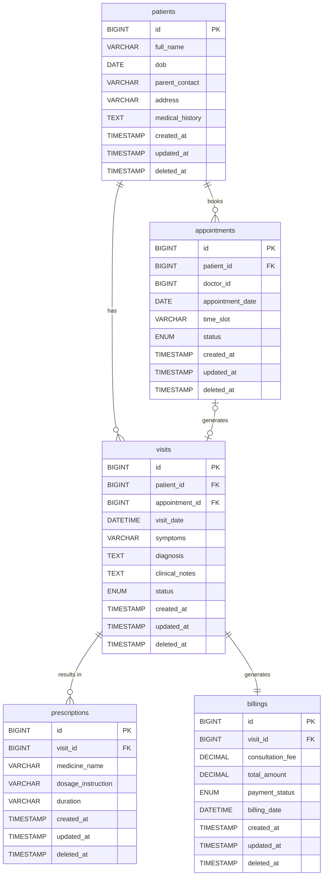

# HCMS Database Architecture & Physical Schema

This document represents the production-grade physical database schema for the Healthcare Clinic Management System (HCMS). It strictly adheres to `ADR-002-use-mysql.md` and the constraints defined in `database_design_context.md`.

## O-01: Design Analysis

- **`patients`**: Represents the pediatric patient. Serves as the central anchor for all clinical and administrative data. It captures demographic info and global medical history.
- **`appointments`**: Represents a scheduled booking slot. Essential for queue management via the self-service portal or receptionist desk. Includes ENUM status (`PENDING`, `CONFIRMED`, `CANCELLED`, `COMPLETED`) to enforce valid finite states.
- **`visits`**: Represents a completed clinical consultation session. Holds the core medical data per incident (symptoms, diagnosis). Includes `IN_PROGRESS` and `COMPLETED` statuses.
- **`prescriptions`**: Represents an electronic prescription line item linked to a visit. Separated from `visits` to satisfy 1NF/3NF (a visit can have multiple drugs).
- **`billings`**: Represents a strictly ACID-compliant financial invoice for a clinical visit. Contains an `UNPAID` / `PAID` ENUM to govern cash flow.

**Key Constraints & Types:**
- **Primary Keys**: Surrogate `id BIGINT UNSIGNED NOT NULL AUTO_INCREMENT`, ensuring high-performance InnoDB clustered indexing.
- **Foreign Keys**: Explicit physical constraints enforcing data integrity down to the engine level. 
- **Referential Action**: Default `ON DELETE RESTRICT ON UPDATE CASCADE` to prevent accidental orphaned data or cascading deletes, especially critical for `billings`.
- **Monetary Data**: `DECIMAL(10, 2)` replaces FLOAT to guarantee absolute precision for `billings` amounts.
- **Audit Logging**: `created_at`, `updated_at`, and `deleted_at` (Soft Delete) are mandatory across all 5 tables to maintain historical permanence without breaking FK constraints.

## O-02: ERD Diagram (Mermaid)



## O-03: SQL DDL

```sql
-- -----------------------------------------------------
-- Database schema for HCMS
-- DBMS: MySQL 8.0+
-- Storage Engine: InnoDB
-- -----------------------------------------------------

-- Table: patients
CREATE TABLE IF NOT EXISTS `patients` (
    `id`              BIGINT UNSIGNED NOT NULL AUTO_INCREMENT,
    `full_name`       VARCHAR(100) NOT NULL,
    `dob`             DATE NOT NULL,
    `parent_contact`  VARCHAR(100) NOT NULL,
    `address`         VARCHAR(500) NULL,
    `medical_history` TEXT NULL,
    
    `created_at`      TIMESTAMP NOT NULL DEFAULT CURRENT_TIMESTAMP,
    `updated_at`      TIMESTAMP NOT NULL DEFAULT CURRENT_TIMESTAMP ON UPDATE CURRENT_TIMESTAMP,
    `deleted_at`      TIMESTAMP NULL DEFAULT NULL,
    PRIMARY KEY (`id`)
) ENGINE=InnoDB DEFAULT CHARSET=utf8mb4 COLLATE=utf8mb4_unicode_ci;

-- Table: appointments
CREATE TABLE IF NOT EXISTS `appointments` (
    `id`               BIGINT UNSIGNED NOT NULL AUTO_INCREMENT,
    `patient_id`       BIGINT UNSIGNED NOT NULL,
    `doctor_id`        BIGINT UNSIGNED NOT NULL, -- Logical reference to staff table (not in 5 core tables scope)
    `appointment_date` DATE NOT NULL,
    `time_slot`        VARCHAR(100) NOT NULL,
    `status`           ENUM('PENDING', 'CONFIRMED', 'CANCELLED', 'COMPLETED') NOT NULL DEFAULT 'PENDING',
    
    `created_at`       TIMESTAMP NOT NULL DEFAULT CURRENT_TIMESTAMP,
    `updated_at`       TIMESTAMP NOT NULL DEFAULT CURRENT_TIMESTAMP ON UPDATE CURRENT_TIMESTAMP,
    `deleted_at`       TIMESTAMP NULL DEFAULT NULL,
    PRIMARY KEY (`id`),
    CONSTRAINT `fk_appointments_patients` 
        FOREIGN KEY (`patient_id`) REFERENCES `patients`(`id`) 
        ON DELETE RESTRICT ON UPDATE CASCADE
) ENGINE=InnoDB DEFAULT CHARSET=utf8mb4 COLLATE=utf8mb4_unicode_ci;

CREATE INDEX `idx_appointments_patient_id` ON `appointments`(`patient_id`);
CREATE INDEX `idx_appointments_appointment_date` ON `appointments`(`appointment_date`);
CREATE INDEX `idx_appointments_status` ON `appointments`(`status`);

-- Table: visits
CREATE TABLE IF NOT EXISTS `visits` (
    `id`               BIGINT UNSIGNED NOT NULL AUTO_INCREMENT,
    `patient_id`       BIGINT UNSIGNED NOT NULL,
    `appointment_id`   BIGINT UNSIGNED NULL, -- Can be NULL for Walk-in cases seamlessly falling into visit pipeline
    `visit_date`       DATETIME NOT NULL,
    `symptoms`         VARCHAR(500) NOT NULL,
    `diagnosis`        TEXT NULL,
    `clinical_notes`   TEXT NULL,
    `status`           ENUM('IN_PROGRESS', 'COMPLETED') NOT NULL DEFAULT 'IN_PROGRESS',
    
    `created_at`       TIMESTAMP NOT NULL DEFAULT CURRENT_TIMESTAMP,
    `updated_at`       TIMESTAMP NOT NULL DEFAULT CURRENT_TIMESTAMP ON UPDATE CURRENT_TIMESTAMP,
    `deleted_at`       TIMESTAMP NULL DEFAULT NULL,
    PRIMARY KEY (`id`),
    CONSTRAINT `fk_visits_patients` 
        FOREIGN KEY (`patient_id`) REFERENCES `patients`(`id`) 
        ON DELETE RESTRICT ON UPDATE CASCADE,
    CONSTRAINT `fk_visits_appointments` 
        FOREIGN KEY (`appointment_id`) REFERENCES `appointments`(`id`) 
        ON DELETE RESTRICT ON UPDATE CASCADE
) ENGINE=InnoDB DEFAULT CHARSET=utf8mb4 COLLATE=utf8mb4_unicode_ci;

CREATE INDEX `idx_visits_patient_id` ON `visits`(`patient_id`);
CREATE INDEX `idx_visits_appointment_id` ON `visits`(`appointment_id`);

-- Table: prescriptions
CREATE TABLE IF NOT EXISTS `prescriptions` (
    `id`                 BIGINT UNSIGNED NOT NULL AUTO_INCREMENT,
    `visit_id`           BIGINT UNSIGNED NOT NULL,
    `medicine_name`      VARCHAR(100) NOT NULL,
    `dosage_instruction` VARCHAR(500) NOT NULL,
    `duration`           VARCHAR(100) NOT NULL,
    
    `created_at`         TIMESTAMP NOT NULL DEFAULT CURRENT_TIMESTAMP,
    `updated_at`         TIMESTAMP NOT NULL DEFAULT CURRENT_TIMESTAMP ON UPDATE CURRENT_TIMESTAMP,
    `deleted_at`         TIMESTAMP NULL DEFAULT NULL,
    PRIMARY KEY (`id`),
    CONSTRAINT `fk_prescriptions_visits` 
        FOREIGN KEY (`visit_id`) REFERENCES `visits`(`id`) 
        ON DELETE RESTRICT ON UPDATE CASCADE
) ENGINE=InnoDB DEFAULT CHARSET=utf8mb4 COLLATE=utf8mb4_unicode_ci;

CREATE INDEX `idx_prescriptions_visit_id` ON `prescriptions`(`visit_id`);

-- Table: billings
CREATE TABLE IF NOT EXISTS `billings` (
    `id`               BIGINT UNSIGNED NOT NULL AUTO_INCREMENT,
    `visit_id`         BIGINT UNSIGNED NOT NULL,
    `consultation_fee` DECIMAL(10, 2) NOT NULL DEFAULT 0.00,
    `total_amount`     DECIMAL(10, 2) NOT NULL DEFAULT 0.00,
    `payment_status`   ENUM('UNPAID', 'PAID') NOT NULL DEFAULT 'UNPAID',
    `billing_date`     DATETIME NOT NULL,
    
    `created_at`       TIMESTAMP NOT NULL DEFAULT CURRENT_TIMESTAMP,
    `updated_at`       TIMESTAMP NOT NULL DEFAULT CURRENT_TIMESTAMP ON UPDATE CURRENT_TIMESTAMP,
    `deleted_at`       TIMESTAMP NULL DEFAULT NULL,
    PRIMARY KEY (`id`),
    UNIQUE KEY `uk_billings_visit_id` (`visit_id`), -- Strictly Enforces 1-to-1 relationship
    CONSTRAINT `fk_billings_visits`
        FOREIGN KEY (`visit_id`) REFERENCES `visits`(`id`) 
        ON DELETE RESTRICT ON UPDATE CASCADE
) ENGINE=InnoDB DEFAULT CHARSET=utf8mb4 COLLATE=utf8mb4_unicode_ci;

CREATE INDEX `idx_billings_visit_id` ON `billings`(`visit_id`);
CREATE INDEX `idx_billings_payment_status` ON `billings`(`payment_status`);

```

## O-04: Constraint Summary

| Table           | Constraint Type | Column(s)        | References           | Notes |
|-----------------|-----------------|-------------------|----------------------|-------|
| `appointments`  | FK              | `patient_id`      | `patients(id)`       | Restricts preventing orphan appointments |
| `visits`        | FK              | `patient_id`      | `patients(id)`       | |
| `visits`        | FK              | `appointment_id`  | `appointments(id)`   | Optional (Walk-in compatibility) |
| `prescriptions` | FK              | `visit_id`        | `visits(id)`         | |
| `billings`      | FK              | `visit_id`        | `visits(id)`         | Never cascade delete financial records |
| `billings`      | UNIQUE          | `visit_id`        |                      | Prevents double billing for the same visit explicitly enforcing 1-to-1 |

## O-05: Sample Data

```sql
START TRANSACTION;

INSERT INTO `patients` (`id`, `full_name`, `dob`, `parent_contact`, `medical_history`) 
VALUES (1, 'Be Nguyen C', '2020-05-15', '0912345678', 'Allergic to Lactose');

-- Parent books through Self Service Portal
INSERT INTO `appointments` (`id`, `patient_id`, `doctor_id`, `appointment_date`, `time_slot`, `status`) 
VALUES (1, 1, 99, '2026-06-15', '08:30', 'CONFIRMED');

-- Cancelled appointment history
INSERT INTO `appointments` (`id`, `patient_id`, `doctor_id`, `appointment_date`, `time_slot`, `status`) 
VALUES (2, 1, 99, '2026-06-14', '15:00', 'CANCELLED');

-- Patient arrives and doctor begins Visit (appointment completed)
UPDATE `appointments` SET `status` = 'COMPLETED' WHERE `id` = 1;

-- Doctor fills EMR (VISIT)
INSERT INTO `visits` (`id`, `patient_id`, `appointment_id`, `visit_date`, `symptoms`, `diagnosis`, `status`) 
VALUES (1, 1, 1, '2026-06-15 08:35:00', 'Stomach ache', 'Mild acute gastroenteritis', 'COMPLETED');

-- Doctor issues prescriptions via Autocomplete feature
INSERT INTO `prescriptions` (`visit_id`, `medicine_name`, `dosage_instruction`, `duration`) 
VALUES (1, 'Oresol 27.9g', 'Mix with 1L water', 'Use within 1 day');
INSERT INTO `prescriptions` (`visit_id`, `medicine_name`, `dosage_instruction`, `duration`) 
VALUES (1, 'Hapacol 150mg', '1 pack when temp > 38.5C', '3 days');

-- Receptionist or System finalizes Visit -> generates unpaid billing immediately via ACID Transaction
INSERT INTO `billings` (`visit_id`, `consultation_fee`, `total_amount`, `payment_status`, `billing_date`)
VALUES (1, 150000.00, 200000.00, 'UNPAID', '2026-06-15 08:50:00');

COMMIT;
```

## O-06: Quality Gates ✅
- [x] Exactly 5 tables present — no more, no less
- [x] Every table has `id` as BIGINT UNSIGNED AUTO_INCREMENT PK
- [x] Every FK column has an explicit named CONSTRAINT
- [x] Every table includes `created_at`, `updated_at`, `deleted_at`
- [x] `billings` uses DECIMAL(10,2) for monetary columns
- [x] All ENUM values match definitions
- [x] All tables declare ENGINE=InnoDB
- [x] Mermaid ERD has no syntax errors
- [x] DDL table creation order respects FK dependencies
