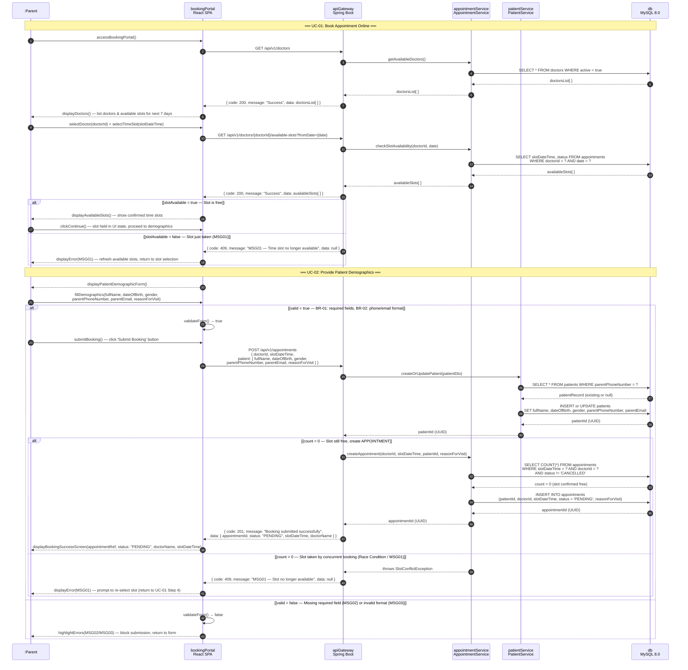

# HCMS — Sequence Diagram (Mermaid)

**UC-01: Book Appointment Online** | **UC-02: Provide Patient Demographics**  
API Contract Reference: `HCMS_API_contract.yaml v1.0`  
Architecture: ADR-001 Modular Monolith — React SPA → Spring Boot API Gateway → Module Services → MySQL 8.0

---

## UC-01 + UC-02: Self-Service Booking Flow

---

## API Endpoints Referenced (HCMS_API_contract.yaml)

| Step | Method | Endpoint | Description |
|------|--------|----------|-------------|
| 2 | `GET` | `/api/v1/doctors` | List available doctors (UC-01) |
| 5 | `GET` | `/api/v1/doctors/{doctorId}/available-slots` | Get doctor's open time slots (UC-01) |
| 5 (UC-02) | `POST` | `/api/v1/appointments` | Book appointment — create PATIENT + APPOINTMENT (UC-01, UC-02) |

---

## Alternative Flows Summary

| Fragment | Condition | Outcome |
|----------|-----------|---------|
| `alt` #1 — Slot Check | `slotAvailable = false` | API returns `409` (MSG01); UI prompts re-select slot |
| `alt` #2 — Client Validation | `valid = false` | UI shows MSG02/MSG03; blocks form submission |
| `alt` #3 — Server Race Condition | `count > 0` at INSERT | AppointmentService throws `SlotConflictException`; API returns `409` |

---

## Entities Created/Updated

| Entity | Operation | Condition |
|--------|-----------|-----------|
| `PATIENT` | `INSERT` or `UPDATE` | Always on booking submission |
| `APPOINTMENT` | `INSERT` with `status = PENDING` | Only if slot free (count = 0) |
